# Programación para internet - Proyecto/Cliente Nativo Android

Cliente React Native que hace consultas al [servidor](https://github.com/DieGopherLT/Proyecto_Progra_Internet_Server)
Y se apoya de la siguiente [página web](https://github.com/DieGopherLT/Proyecto_Progra_Internet_WebClient)

- Alumno: Diego López Torres 
- Código: 215672951
- Sección: D01

## Sinopsis del proyecto

Esta aplicación Android desarrollada con el Framework React Native sirve para llevar a cabo el control de
una carrera virtual universitaria, los estudiantes pueden registrarse e iniciar sesión al mismo tiempo con sus mismas credenciales que usan
para acceder a sistemas de la red universitaria, dentro de la aplicación pueden consultar su posición dentro
de la carrera, subir una foto de perfil a gusto, subir sus progresos, ver cuantos kilómetros les falta
para la meta y ver cuantos días faltan para que termine la carrera.

### Funcionalidades implementadas

El proyecto cuenta con bastantes funcionalidades entre las que se encuentran:

- Inicio de sesión con código y NIP (credenciales de estudiantes de la UDG).
- Ver el estado actual del ranking, los 3 primeros lugares y donde te sitúas
  (en caso de que no estés en los 3 primeros).
- Pull to refresh para actualizar el ranking.
- Cuenta con un menú hamburguesa en la parte superior que al presionarlo permite:
  
    - Ver tus datos de estudiante.
    - Cerrar sesión.
    - Subir una foto de perfil.
- Permanecer con la sesión iniciada después de cerrar la aplicación y volver a abrirla.
- Permite subir tu progreso mediante un formulario donde debes adjuntar los kilómetros que corriste, el tiempo en que lo hiciste y una fotografía como evidencia.
  - Esos datos se mandarán a una página web mencionada anteriormente, donde una persona los verá y podrá decidir si
    aprobar si es verídico lo que mandaste.

### Capturas de pantalla de la aplicación

Mientras la aplicación carga, se muestra en pantalla una pequeña animación y un mensaje indicando que la app está cargando.

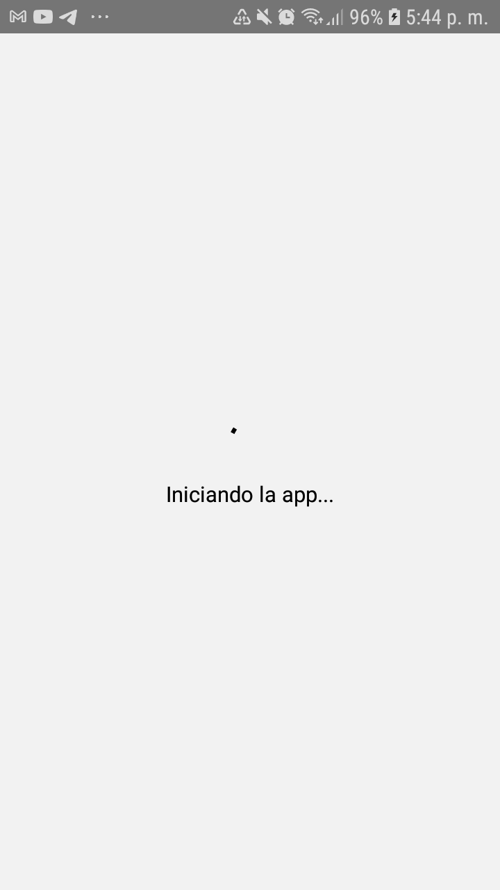

| Inicio de sesión | Inicio de sesión mostrando alerta de error |
| ---------------------- | -------------------------------------------------------------- |
| 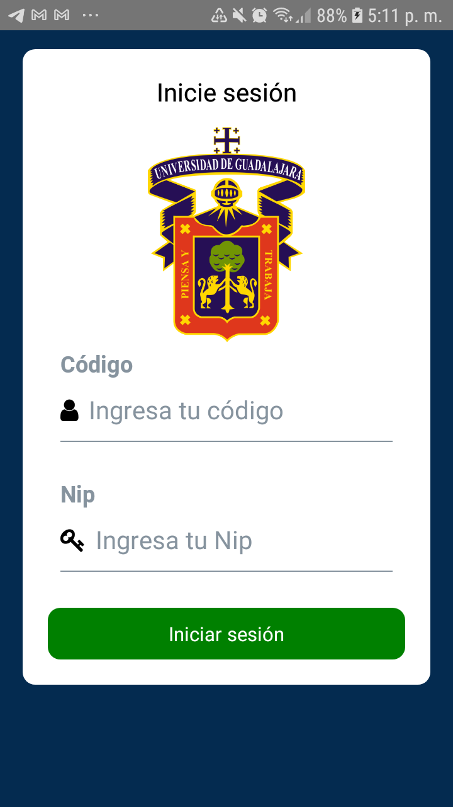 | 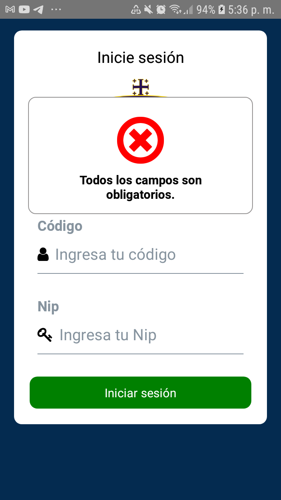 |

| Pantalla principal | Opciones del menú hamburguesa |
| ---------------------- | -------------------------------------------------------------- |
| 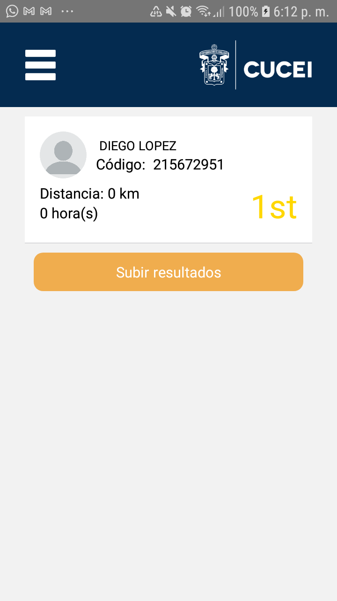 | 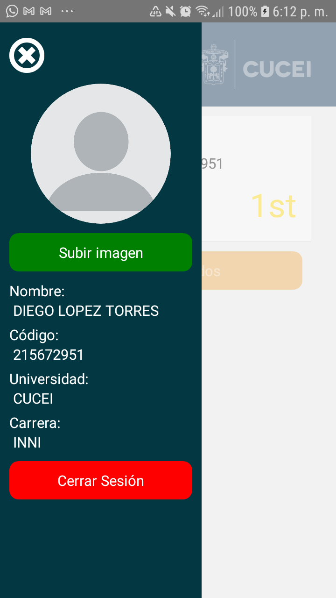 |

#### Funcionalidad para subir imágenes

Esta es la galería personal, lista para elegir una imagen. Se elegirá la segunda imagen.

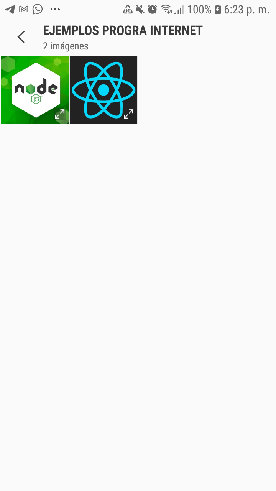

| Nueva imagen en menú | Nueva imagen en pantalla principal |
| ---------------------- | -------------------------------------------------------------- |
| 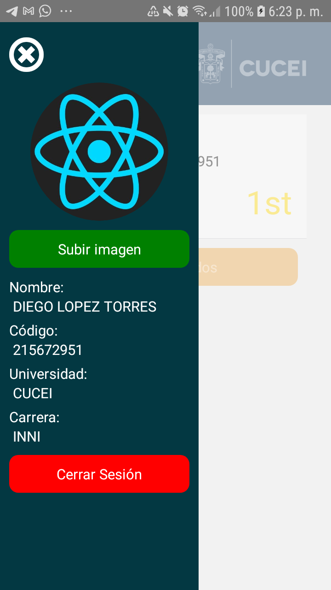 | 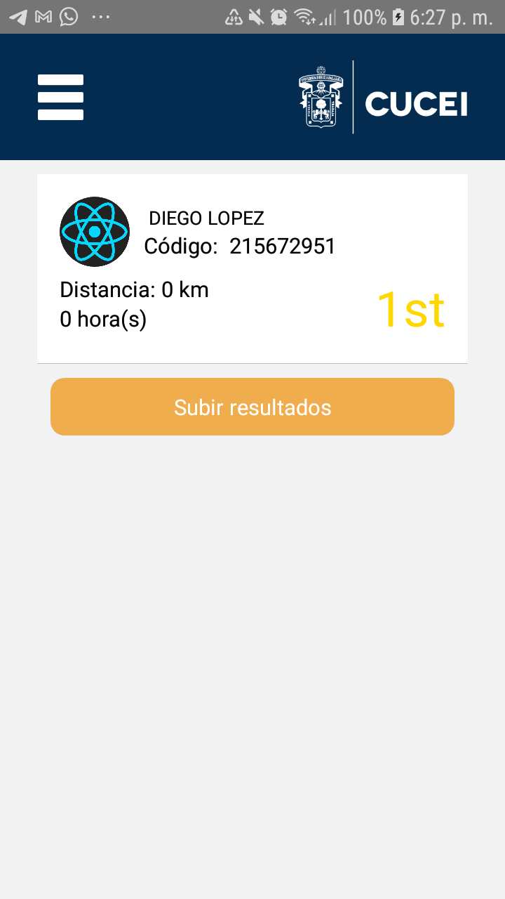 |

Se agregaron unos cuantos participantes más con nombres e imágenes de tecnologías a fin de visualizar el ranking con más participantes. Todo esto con fines meramente demostrativos.

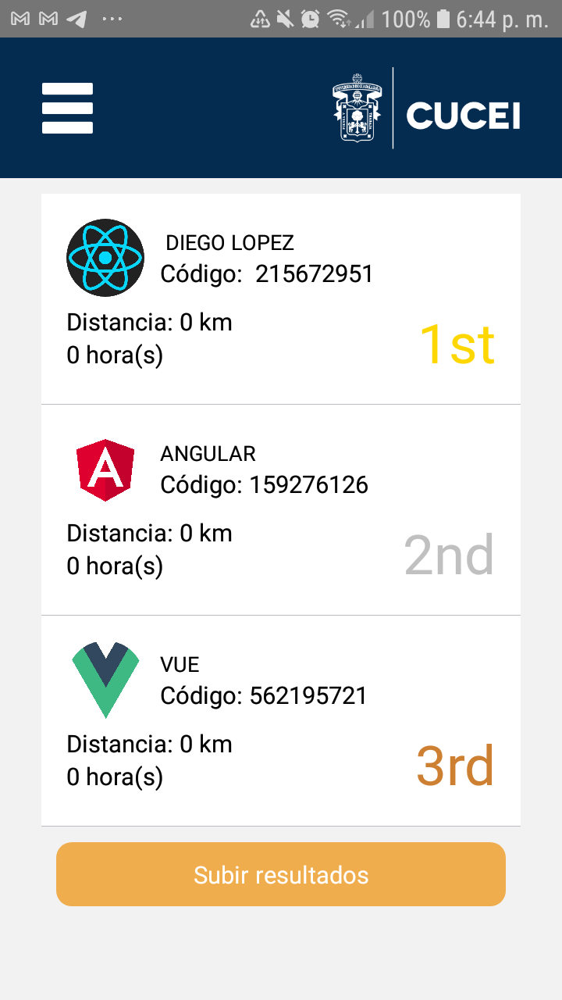

#### Vistas relacionadas con el progreso en la carrera

En las siguientes 2 vistas se puede visualizar el progreso dentro de la carrera en 2 aspectos: 
- Cuan cerca está el evento por finalizar, son 10 días.
- Cuan cerca se encuentra de la meta, son 10 kilómetros.

Adicionalmente, también se puede consultar la posición dentro de la carrera y conocer cuantos participantes existen en total desde esta vista.

| Visualización de tu progreso | Formulario para subir tus progresos |
| ---------------------- | -------------------------------------------------------------- |
| 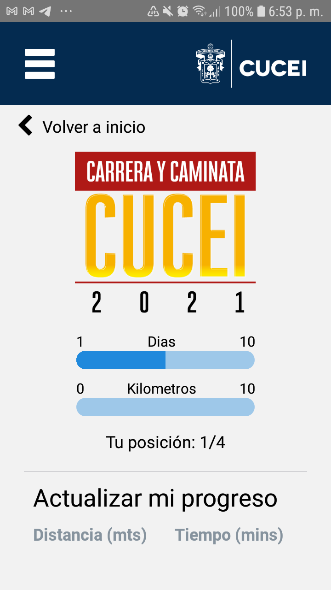 | 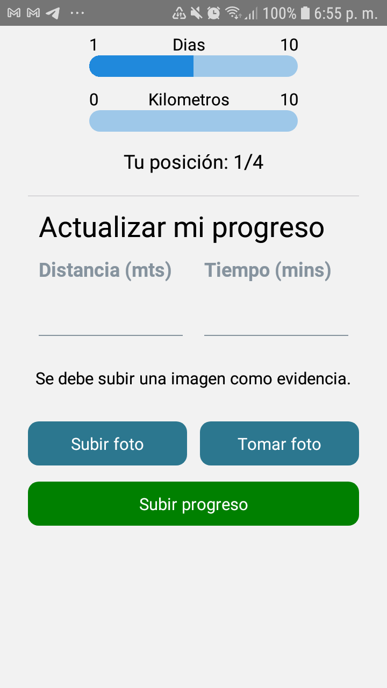 |

A continuación se realizará una solicitud para actualizar el progreso llenando el formulario, la imagen mostrada no es la adecuada para subir como evidencia, solo está puesta con fines demostrativos.

| Llenando la solicitud | Recibiendo respuesta |
| ---------------------- | -------------------------------------------------------------- |
| 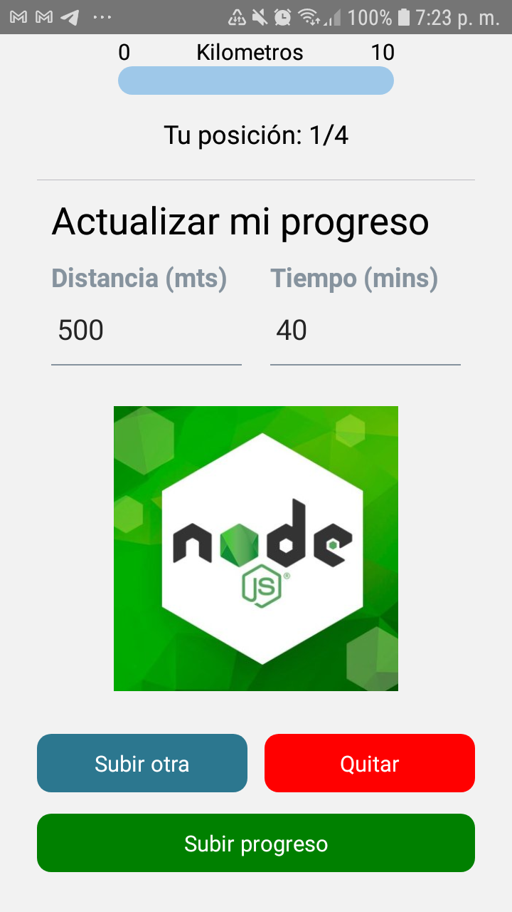 | 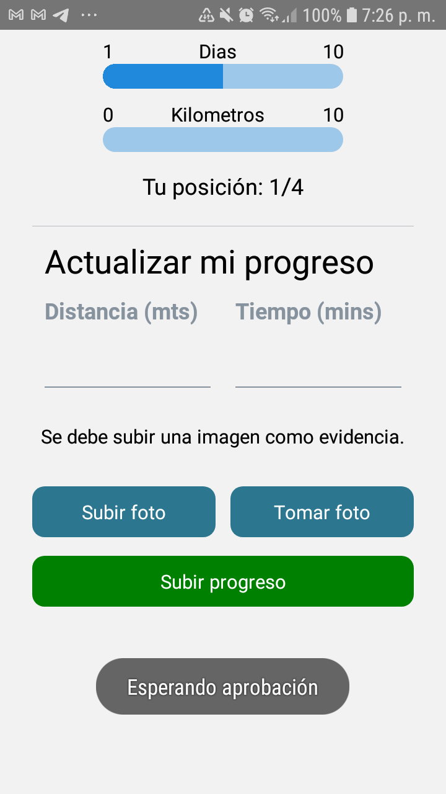 |

Ahora en la página web cuyo repositorio puede ser consultado [aquí](https://github.com/DieGopherLT/Proyecto_Progra_Internet_WebClient) esa solicitud fue enviada, desde ahí
un administrador podrá ver la solicitud de progreso y aprobarla o rechazarla.

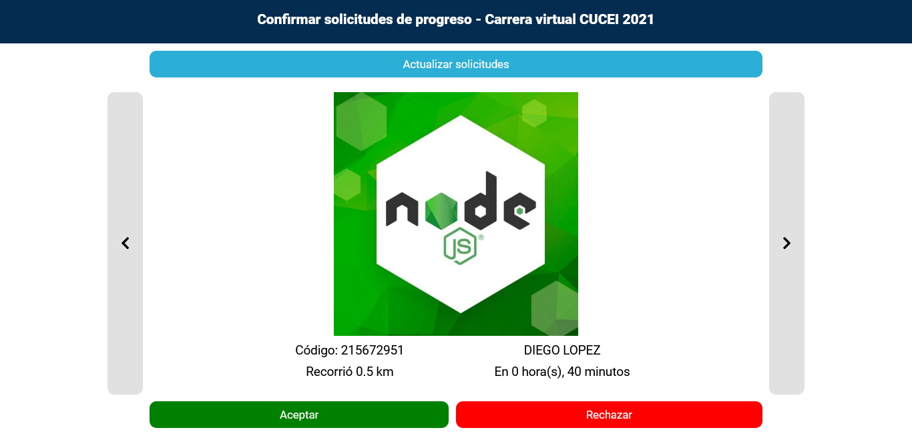

De aprobarse la solicitud, el progreso del solicitante se le sumará a su progreso actual el tiempo y distancia recorrida mostrada en pantalla.
De ser rechazada, nada cambiará.
